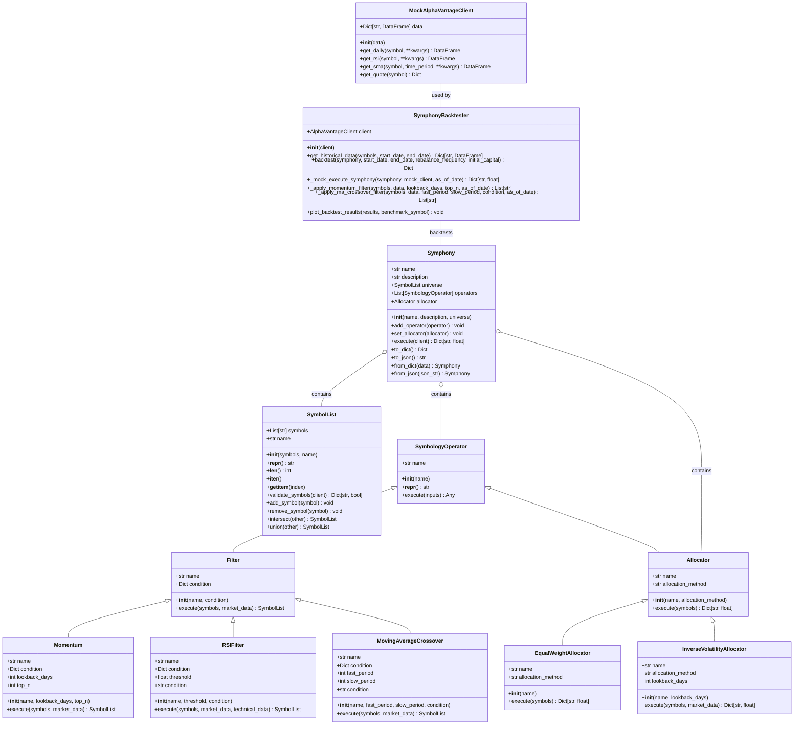

# Composer Symphony Module - Class Diagram

## Class Relationships

### Core Data Structure
- `SymbolList`: Container for managing lists of stock/ETF symbols

### Operator Hierarchy
- `SymbologyOperator`: Abstract base class for all operators
  - `Filter`: Base class for operators that filter symbols
    - `Momentum`: Selects top performing symbols by momentum
    - `RSIFilter`: Filters symbols based on RSI values
    - `MovingAverageCrossover`: Selects symbols based on MA crossovers
  - `Allocator`: Base class for allocation methods
    - `EqualWeightAllocator`: Assigns equal weight to all symbols
    - `InverseVolatilityAllocator`: Weights inversely to volatility

### Strategy Definition
- `Symphony`: Complete trading strategy defined by operators
  - Contains `SymbolList` as the universe
  - Contains multiple `SymbologyOperator` instances
  - Contains an `Allocator` for weighting

### Testing & Simulation
- `SymphonyBacktester`: Backtests Symphony strategies
- `MockAlphaVantageClient`: Mock client for testing/backtesting

## Key Dependencies

- `AlphaVantageClient`: For retrieving market data
- `pandas`: For data manipulation
- `matplotlib`: For visualization

## Architecture Analysis

### Current Design

The module uses an object-oriented design with good separation of concerns:

1. `Symphony` acts as a container for the strategy components
2. The operator hierarchy allows for extensibility
3. `SymphonyBacktester` separates testing from strategy definition

### Potential Issues

1. `Symphony.execute()` method is complex and could be broken down
2. `SymphonyBacktester.backtest()` is very long and does multiple things
3. The mock execution methods contain duplicate logic from the real implementations
4. Error handling is inconsistent across methods

### Refactoring Targets

1. **Symphony.execute()**: Should be decomposed into smaller methods
2. **SymphonyBacktester.backtest()**: Should be split into multiple methods
3. **_mock_execute_symphony()**: Could share logic with actual `execute()` method
4. **Data validation**: Add consistent validation across all methods
